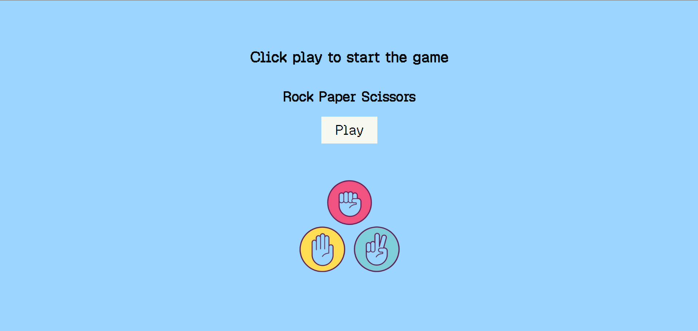
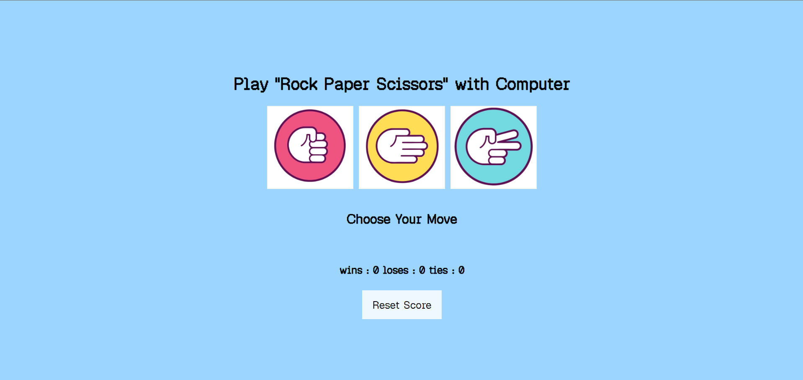

# 🎮 Rock Paper Scissors

A simple and interactive Rock Paper Scissors game built using **HTML**, **CSS**, and **JavaScript**.

## 🚀 Live Demo
https://mvstanusri.github.io/Rock-paper-scissors/


## 📸 Screenshot



## ✨ Features

- 🪨 Rock, 📄 Paper, ✂️ Scissors gameplay
- 🤖 Random computer moves
- 🏆 Win, Lose, and Tie detection
- 📊 Live score tracking
- 💾 Score persistence using Local Storage
- 🔄 Reset Score button
- 🎨 Clean and responsive user interface

## 🛠️ Technologies Used

- HTML5
- CSS3
- JavaScript (ES6)
- Local Storage API

## 📂 Project Structure

```
rock-paper-scissors/
│── index.html
│── style.css
│── index.js
│── README.md
└── images/
```

## 🎯 How to Play

1. Click Rock, Paper, or Scissors.
2. The computer randomly chooses its move.
3. The winner is displayed.
4. Scores are automatically saved using Local Storage.
5. Click **Reset Score** to start over.

## 📚 What I Learned

- JavaScript functions
- Conditional statements
- Random number generation
- DOM manipulation
- Event handling
- Objects
- Template literals
- Local Storage API
- JSON.parse() and JSON.stringify()

## 👨‍💻 Author

**M. V. S. Tanusri**

GitHub: https://github.com/mvstanusri
